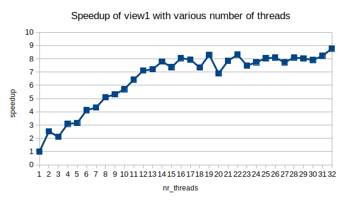
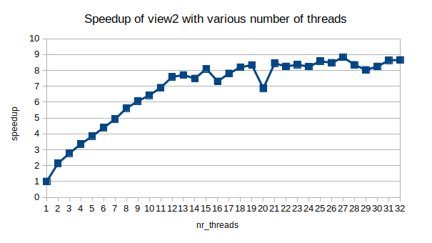
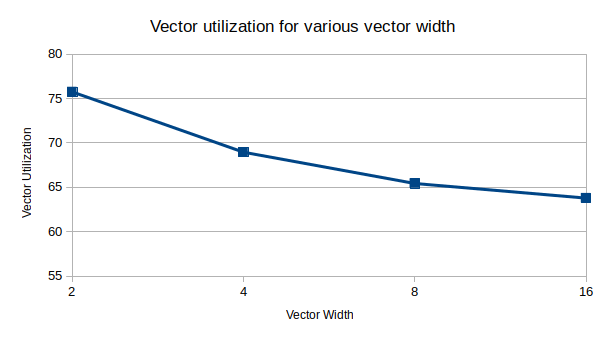

## ISPC
> It compiles a C-based SPMD programming languarge to run on the SIMD units (multiple cores / vector unit) of CPUs and the Intel Xeon Phi architecture. It currently supports the SSE2, SSE4, AVX1, AVX2, AVX512, and Xeon Phi instruction sets.

## Program #1

### 任务划分

对于结果 mandelbrot-thread.ppm，若干连续的行形成一个 tile，每个 thread 负责生成一个 title。结果，4 threads 时，view1 和 view2 分别可获得 3.1x 和 3.35x 的加速比。

### 结果分析

Intel Core i7-6700 CPU with hyper-thread on => 8 logical cores





由图，线程数小于 12 时，speedup 随线程数线性增长。当线程数大于 12 时，speedup 趋于 8，即趋于 CPU 的核心数。

### Intel HT

TODO

## Program #2

### Available operations in CMU418intrin.h

```c++
// Types
__cmu418_vec_float
__cmu418_vec_int
__cmu418_mask
// Mask operations
// Return: __cmu418_mask
_cmu418_init_ones	// 前 first 个 bit 置 1，其它置 0
_cmu418_mask_not	// ~maska
_cmu418_mask_or		// maska | maskb
_cmu418_mask_and	// maska & maskb
_cmu418_cntbits		// 统计 mask 中 1 的个数
// Vector operations
_cmu418_vset_float	// mask 为 1 的元素置指定 value
_cmu418_vset_int
_cmu418_vmove_float	// 移动 mask 为 1 的元素到目的 vector
_cmu418_vmove_int
_cmu418_vload_float	// 将指定数据加载到向量寄存器
_cmu418_vload_int
*_vstore_*
*_vadd_*			// vec_C = vec_A + vec_B
*_vsub_*
*_vmult_*
*_vdiv_*
*_vabs_*
*_vgt_*				// Return a mast of (vec_A > vec_B) if vector lane active
*_vlt_*
*_veq_*
*_hadd_*			// [0 1 2 3] -> [0+1 0+1 2+3 2+3] = [1 1 5 5]
*_interleave_*		// [0 1 2 3 4 5 6 7] -> [0 2 4 6 1 3 5 7]
```

### Vectorized abs() as a example

```c++
void absVector(float* values, float* output, int N) {
  __cmu418_vec_float x;
  __cmu418_vec_float result;
  __cmu418_vec_float zero = _cmu418_vset_float(0.f);
  __cmu418_mask maskAll, maskIsNegative, maskIsNotNegative;

//  Note: Take a careful look at this loop indexing.  This example
//  code is not guaranteed to work when (N % VECTOR_WIDTH) != 0.
//  Why is that the case?
  for (int i=0; i<N; i+=VECTOR_WIDTH) {

    // All ones
    maskAll = _cmu418_init_ones();

    // All zeros
    maskIsNegative = _cmu418_init_ones(0);

    // Load vector of values from contiguous memory addresses
    _cmu418_vload_float(x, values+i, maskAll);               // x = values[i];

    // Set mask according to predicate
    _cmu418_vlt_float(maskIsNegative, x, zero, maskAll);     // if (x < 0) {

    // Execute instruction using mask ("if" clause)
    _cmu418_vsub_float(result, zero, x, maskIsNegative);      //   output[i] = -x;

    // Inverse maskIsNegative to generate "else" mask
    maskIsNotNegative = _cmu418_mask_not(maskIsNegative);     // } else {

    // Execute instruction ("else" clause)
    _cmu418_vload_float(result, values+i, maskIsNotNegative); //   output[i] = x; }

    // Write results back to memory
    _cmu418_vstore_float(output+i, result, maskAll);
  }
}
```

如果 (N % VECTOR_WIDTH) != 0，则 input 的最后一部分不足以构成一个长为 VECTOR_WIDTH 的向量，此时后面所有的针对长为 VECTOR_WIDTH 的向量运算都会导致错误。解决方法如下

```c++
...
last_part_len = N % VECTOR_WIDTH;
for (int i=0; i<N-last_part_len; i+=VECTOR_WIDTH) {
	...
}
// Handle the last vector
if (last_part_len) {
    maskAll = _cmu418_init_ones(last_part_len);
  	// Do the same as above
}
```


### Debugging for CMU418's fake vector instrinics

Use `./myexp -l` to print a log of executed vector instruction at the end.

### clampedExpSerial()

output[i] = values[i]^exponents[i] && clamp(output[i], 9.999999f)

### Algorithm for vectorized sum

```c++
float arraySumVector(float *valus, int N)
{
    // See code
  	// hadd, interleave
}
```

### 结果分析

#### Metrics

- Vector width
- Total vector instructions
- Vector utilization
- Utilized vector lanes
- Total vector lanes

#### `./myexp -s 10000` with VECTOR_WIDTH in [2, 4, 8, 16]



向量寄存器的利用率随着其长度递减。

## Appendix

- getopt.h
