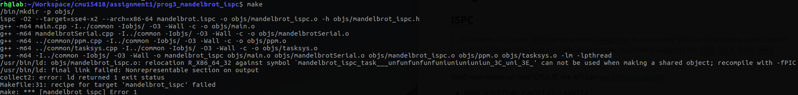
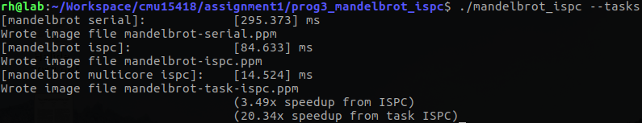

## Program #1

### Intel HT

TODO

### Solutions

> In your writeup, describe your approach and report the final 4-thread speedup obtained.

对于结果 mandelbrot-thread.ppm，若干连续的行形成一个 tile，每个 thread 负责生成一个 title。结果，4 threads 时，view1 和 view2 分别可获得 3.1x 和 3.35x 的加速比。

> Is speedup linear in the number of cores used? In your writeup hypothesize why this is (or is not) the case? (you may also wish to produce a graph for VIEW 2 to help you come up with an answer.)

Machine: Intel Core i7-6700 CPU with hyper-thread on => 8 logical cores


由图，线程数小于 12 时，speedup 随线程数线性增长。当线程数大于 12 时，speedup 趋于 8，即趋于 CPU 的核心数。

## Program #2

### Available operations in CMU418intrin.h

```c++
// Types
__cmu418_vec_float
__cmu418_vec_int
__cmu418_mask
// Mask operations
// Return: __cmu418_mask
_cmu418_init_ones	// 前 first 个 bit 置 1，其它置 0
_cmu418_mask_not	// ~maska
_cmu418_mask_or		// maska | maskb
_cmu418_mask_and	// maska & maskb
_cmu418_cntbits		// 统计 mask 中 1 的个数
// Vector operations
_cmu418_vset_float	// mask 为 1 的元素置指定 value
_cmu418_vset_int
_cmu418_vmove_float	// 移动 mask 为 1 的元素到目的 vector
_cmu418_vmove_int
_cmu418_vload_float	// 将指定数据加载到向量寄存器
_cmu418_vload_int
*_vstore_*
*_vadd_*			// vec_C = vec_A + vec_B
*_vsub_*
*_vmult_*
*_vdiv_*
*_vabs_*
*_vgt_*				// Return a mast of (vec_A > vec_B) if vector lane active
*_vlt_*
*_veq_*
*_hadd_*			// [0 1 2 3] -> [0+1 0+1 2+3 2+3] = [1 1 5 5]
*_interleave_*		// [0 1 2 3 4 5 6 7] -> [0 2 4 6 1 3 5 7]
```

### Vectorized abs() as a example

```c++
void absVector(float* values, float* output, int N) {
  __cmu418_vec_float x;
  __cmu418_vec_float result;
  __cmu418_vec_float zero = _cmu418_vset_float(0.f);
  __cmu418_mask maskAll, maskIsNegative, maskIsNotNegative;

//  Note: Take a careful look at this loop indexing.  This example
//  code is not guaranteed to work when (N % VECTOR_WIDTH) != 0.
//  Why is that the case?
  for (int i=0; i<N; i+=VECTOR_WIDTH) {

    // All ones
    maskAll = _cmu418_init_ones();

    // All zeros
    maskIsNegative = _cmu418_init_ones(0);

    // Load vector of values from contiguous memory addresses
    _cmu418_vload_float(x, values+i, maskAll);               // x = values[i];

    // Set mask according to predicate
    _cmu418_vlt_float(maskIsNegative, x, zero, maskAll);     // if (x < 0) {

    // Execute instruction using mask ("if" clause)
    _cmu418_vsub_float(result, zero, x, maskIsNegative);      //   output[i] = -x;

    // Inverse maskIsNegative to generate "else" mask
    maskIsNotNegative = _cmu418_mask_not(maskIsNegative);     // } else {

    // Execute instruction ("else" clause)
    _cmu418_vload_float(result, values+i, maskIsNotNegative); //   output[i] = x; }

    // Write results back to memory
    _cmu418_vstore_float(output+i, result, maskAll);
  }
}
```

如果 (N % VECTOR_WIDTH) != 0，则 input 的最后一部分不足以构成一个长为 VECTOR_WIDTH 的向量，此时后面所有的针对长为 VECTOR_WIDTH 的向量运算都会导致错误。解决方法如下

```c++
...
last_part_len = N % VECTOR_WIDTH;
for (int i=0; i<N-last_part_len; i+=VECTOR_WIDTH) {
	...
}
// Handle the last vector
if (last_part_len) {
	maskAll = _cmu418_init_ones(last_part_len);
	// Do the same as above
}
```

### Debugging for CMU418's fake vector instrinics

Use `./myexp -l` to print a log of executed vector instruction at the end.

### clampedExpSerial()

output[i] = values[i]^exponents[i] && clamp(output[i], 9.999999f)

### Algorithm for vectorized sum

```c++
float arraySumVector(float *valus, int N)
{
	// See code
	// hadd, interleave
}
```

### Solutions

> Does the vector utilization increase, decrease or stay the same as VECTOR_WIDTH changes? Why?

Metrics:

- Vector width
- Total vector instructions
- Vector utilization
- Utilized vector lanes
- Total vector lanes

`./myexp -s 10000` with VECTOR_WIDTH in [2, 4, 8, 16]


向量寄存器的利用率随着其长度递减。

## Program #3

###  ISPC

> It compiles a C-based SPMD programming languarge to run on the SIMD units (multiple cores / vector unit) of CPUs and the Intel Xeon Phi architecture. It currently supports the SSE2, SSE4, AVX1, AVX2, AVX512, and Xeon Phi instruction sets.

SIMD operations on Intel CPUs (C like API can [see intrinsics guide](https://software.intel.com/sites/landingpage/IntrinsicsGuide/))

- MMX -> SSE[1-4] -> AVX[1-2] -> AVX512
- MMX : 64bits (length of the register)
- SSE[1-4]: 128bits
- AVX[1-2]: 256bits
- AVX512: 512bits
- KNC: @Xeon Phi

### Error on compiling



通过 `--pic` 指定 ispc 编译生成 PIC 版 object 即可。

### Selecting the compiling target of ISPC-based program

由 [ISPC 此处文档](https://ispc.github.io/ispc.html#selecting-the-compilation-target)可知：

- --arch={x86, x86-64,arm}
- --cpu=
- --target=[ISA]-i[mask size]x[gang size] e.g. --target=avx2-i32-16

[ISPC 程序执行模型](https://ispc.github.io/ispc.html#basic-concepts-program-instances-and-gangs-of-program-instances)提出 gang 和 instance 的概念。instance 类似 CUDA PTX 中的 thread，gang 对应于 warp（即最小调度单元），由若干 instances 构成 gang。其大小由 SIMD 单元所用寄存器的大小决定。例如 SSE 使用 128bits 的寄存器，则对于长为 32bit 的 data，向量长度为 4（即 4-wide SSE vector），则 gang size 为 4 或 8。而对于 AVX（使用 256bits 的寄存器），向量长度为 8（即 8-wide AVX vecotr），gang size 可为 4 / 8 / 16。

### Solutions

>What is the maximum speedup you expect given what you know about these CPUs? Why might the number you observe be less than this ideal? (Hint: Consider the characteristics of the computation you are performing? Describe the parts of the image that present challenges for SIMD execution? Comparing the performance of rendering the different views of the Mandelbrot set may help confirm your hypothesis.)
>
>We remind you that for the code described in this subsection, the ISPC compiler maps gangs of program instances to SIMD instructions executed on a single core. This parallelization scheme differs from that of Program 1, where speedup was achieved by running threads on multiple cores.

mandelbrot 程序中涉及变量类型为 float 和 int，长为 32bit，故使用 128bit 寄存器的 SSE 可构成长为 4 的向量，而 AVX 可构成长为 8 的向量，其理论加速比分别为 4x 和 8x，实际为 3.3x（avx1-i32x4）和 6.37x（avx1-i32x8）。不同的 target 所带来的加速比各不相同，如下图。

图 TODO

```c++
static inline int mandel(float c_re, float c_im, int count) {
    float z_re = c_re, z_im = c_im;
    int i;
    for (i = 0; i < count; ++i) {

        if (z_re * z_re + z_im * z_im > 4.f)
           break;

        float new_re = z_re*z_re - z_im*z_im;
        float new_im = 2.f * z_re * z_im;
        z_re = c_re + new_re;
        z_im = c_im + new_im;
    }

    return i;
}

export void mandelbrot_ispc(uniform float x0, uniform float y0, 
                            uniform float x1, uniform float y1,
                            uniform int width, uniform int height, 
                            uniform int maxIterations,
                            uniform int output[])
{
    float dx = (x1 - x0) / width;
    float dy = (y1 - y0) / height;

    foreach (j = 0 ... height, i = 0 ... width) {
            float x = x0 + i * dx;
            float y = y0 + j * dy;

            int index = j * width + i;
            output[index] = mandel(x, y, maxIterations);
    }
}
```

由 mandel 函数可知，if 分支带来了开销。记 routine_T 为 if_statement 为 True 执行的部分，routine_F 为 if_statement 为 False 时执行的部分。串行环境下，routine_T 和 routine_F 开销不同（本例中，overhead(routine_T）< overhead(routine_F))，但在向量化后的 mandel 中，if_statement 部分的执行开销为 max(overhead(routine_T) , overhead(routine_F))。相同 target（avx1-i32x16）下，生成 view1 和 view2 对应的加速比分别为 9.93x 和 8.10x，它们 if_statement 的 True rate 分别为 1.1% 和 2.4%（仔细想想很有道理；）。

>Run `mandelbrot_ispc` with the parameter `--tasks`. What speedup do you observe on view 1? What is the speedup over the version of `mandelbrot_ispc` that does not partition that computation into tasks?

target=avx1-i32x16 下，mandelbort_ispc speedup 为 9.89x，而 mandelbrot_task_ispc 为 19.5x，大约为前者的两倍。

>There is a simple way to improve the performance of `mandelbrot_ispc --tasks` by changing the number of tasks the code creates. By only changing code in the function `mandelbrot_ispc_withtasks()`, you should be able to achieve performance that exceeds the sequential version of the code by about 13-14 times! How did you determine how many tasks to create? Why does the number you chose work best?

任务数设置为 machine 核心数的两倍，本机实验我使用的机器有 8 个逻辑核，故 task 数设为 16（target=sse4-i32x8），结果如下：



> What are differences between the pthread abstraction (used in Program 1) and the ISPC task abstraction? There are some obvious differences in semantics between the (create/join and (launch/sync) mechanisms, but the implications of these differences are more subtle. Here's a thought experiment to guide your answer: what happens when you launch 10,000 ISPC tasks? What happens when you launch 10,000 pthreads?

[ISPC task](https://ispc.github.io/ispc.html#tasking-model) `launch` 为异步提交任务，launched tasks 可并行执行。

> *The smart-thinking student's question*: Hey wait! Why are there two different mechanisms (`foreach` and `launch`) for expressing independent, parallelizable work to the ISPC system? Couldn't the system just partition the many iterations of `foreach` across all cores and also emit the appropriate SIMD code for the cores?

这里需要考虑不同层次任务的不同划分需求。并行化一个程序需要考虑数据的局部性、并行度等等。若 foreach 中的自动调度算法足够 smart，能够很好的权衡以上需求，那么一个 foreach 挺好的。

## Appendix

- getopt.h
